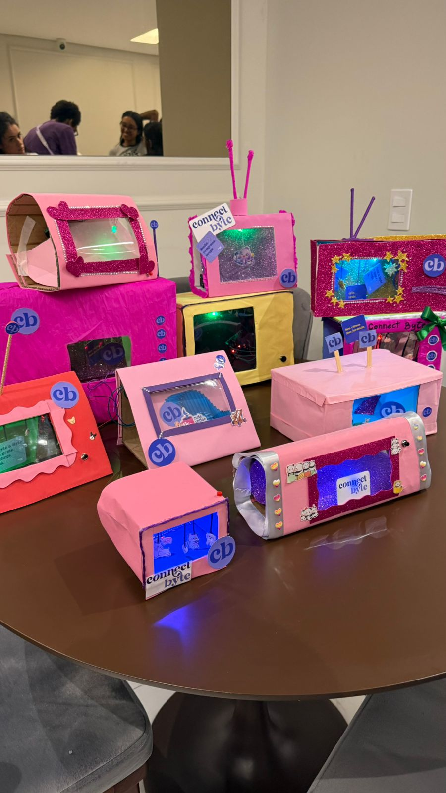

🇺🇸 English | 🇧🇷 [Português](README.pt.md)

  

# Arduino RGB TV

A creative electronics project where participants build a mini cardboard television with interactive RGB lighting controlled by an Arduino and a push-button.

This project was developed during a Connect Byte monthly workshop and introduces fundamental concepts of electronics, color mixing, and embedded programming.

---

## Overview

In this project, participants build a custom "TV" casing and wire an interactive circuit. 

Using an Arduino, an RGB LED, and a push-button, the system mimics changing TV channels. Each time the button is pressed, the Arduino updates a state machine to change the color of the screen (Red, Green, Blue, Party Mode, or Off).

This project introduces key concepts such as:
- basic electronics (Voltage, Current, and GND)
- the importance of resistors for current limiting
- how RGB LEDs work and how to mix colors using PWM
- reading digital inputs (buttons) and debouncing
- state machines and `switch/case` logic

---

## Circuit

- **RGB LED** → Connect each color leg (R, G, B) to a 220Ω resistor, then to Arduino PWM pins (e.g., 9, 10, 11). Connect the common leg to GND or 5V (depending on the LED type).
- **Push-button** → One side to GND, the other to Arduino digital pin 2 (using internal `INPUT_PULLUP`).
- **Power** → The system can be powered by a battery holder connected to the Arduino's VIN and GND pins.

---

## Code

The example code is available in the `code` folder.

The project can be opened using **PlatformIO in Visual Studio Code**.

Main file:
`code/led-tv/src/main.cpp`

For a deeper dive into reading button states, `millis()` debouncing, and programming the TV channels, watch our [workshop recording](https://www.youtube.com/watch?v=jdX4qP33tmc) where we explain the code step-by-step.

See more in our [workshop](https://www.canva.com/design/DAHD3Qv_aYI/iuNidV_qm2hbHpIOjla_cA/edit?utm_content=DAHD3Qv_aYI&utm_campaign=designshare&utm_medium=link2&utm_source=sharebutton).

---

## Connect Byte
Website: https://connect-byte.org  
Linkedin: https://www.linkedin.com/company/connect-byte/  
Instagram: [@connectbyte_](https://www.instagram.com/connectbyte_)